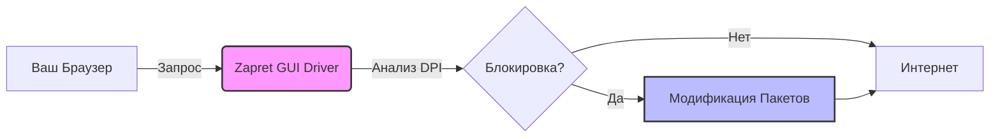

```markdown
<div align="center">

# 🛡️ Zapret GUI

[](https://github.com/bol-van/zapret)
[](LICENSE)
[](#)
[](#)

**Современный графический интерфейс для инструмента обхода блокировок Zapret.**  
*Минимум настроек. Максимальная эффективность. Полная автоматизация.*

</div>

---

## 📖 О Проекте

**Zapret GUI** — это форк популярного инструмента `zapret`, дополненный интуитивно понятным графическим интерфейсом. Наша цель — сделать технологию обхода DPI (Deep Packet Inspection) доступной для каждого пользователя, исключив необходимость работы с командной строкой и ручного редактирования конфигурационных файлов.

> [!IMPORTANT]
> **Принцип работы:** Программа автоматически анализирует сетевое окружение и подбирает оптимальные параметры обхода. Пользователю достаточно нажать одну кнопку. **Настройка не требуется.**

---

## ✨ Ключевые Особенности

| Возможность | Описание |
| :--- | :--- |
| 🚀 **Zero-Config** | Никаких сложных конфигов. Система сама определит работающий метод. |
| 🧠 **Auto-Detection** | Автоматический подбор стратегий обхода (Fake, Split, Desync) в реальном времени. |
| 🖥️ **Native GUI** | Легковесный интерфейс, не перегружающий системные ресурсы. |
| 🛡️ **Privacy First** | Весь трафик обрабатывается локально. Никакие данные не отправляются на сторонние серверы. |
| 🔄 **Auto-Update** | Встроенная система обновления сигнатур и ядра zapret. |

---

## ⚡ Быстрый Старт

Вам не нужно быть сетевым инженером, чтобы начать работу.

### 1. Установка
Скачайте последнюю версию из раздела [Releases](../../releases).

```bash
# Пример для Windows (PowerShell)
winget install zapret-gui
```

### 2. Запуск
Просто запустите исполняемый файл. Программа запросит права администратора для настройки сетевых правил.

### 3. Активация
Нажмите кнопку **"Start Protection"**. Индикатор статуса изменится на зеленый ✅.

> [!TIP]
> **Совет:** Если автоматический режим не сработал на вашем провайдере, перейдите во вкладку "Advanced" и выберите ручную стратегию из списка проверенных пресетов.

---

## 🛠️ Как Это Работает

Мы используем модифицированное ядро `zapret`, которое внедряется в сетевой стек операционной системы.



1.  **Перехват:** Программа перехватывает исходящие TCP-пакеты.
2.  **Анализ:** Проверяется наличие признаков DPI-фильтрации.
3.  **Модификация:** При необходимости пакеты фрагментируются или видоизменяются (TTL, Checksum, Fake-пакеты).
4.  **Доставка:** Целевой сервер получает запрос, фильтр пропускает трафик.

---

## 📸 Интерфейс

<div align="center">
  

*Главная панель управления*

</div>

<details>
<summary>🖼️ Показать скриншот настроек</summary>


</details>

---

## ❓ Часто Задаваемые Вопросы

<details>
<summary><b>Это безопасно?</b></summary>

> Да. Исходный код открыт и доступен для аудита. Программа не передает ваши личные данные третьим лицам. Она лишь модифицирует сетевые пакеты на уровне ОС.
</details>

<details>
<summary><b>Снизится ли скорость интернета?</b></summary>

> Влияние на скорость минимально (менее 1-2%). В некоторых случаях скорость может даже вырасти за счет оптимизации маршрутизации пакетов.
</details>

<details>
<summary><b>Работает ли это на macOS / Linux?</b></summary>

> Основная поддержка ориентирована на Windows. Версии для Linux находятся в стадии бета-тестирования.
</details>

---

## ⚠️ Отказ от ответственности

> [!WARNING]
> **Юридическая информация**
>
> Данный проект распространяется в образовательных целях. Авторы не несут ответственности за использование программного обеспечения в нарушение законодательства вашей страны.
> Используйте инструмент на свой страх и риск. Убедитесь, что ваши действия не противоречат местным законам об информационном пространстве.

---

## 🤝 Поддержка и Contributing

Мы приветствуем вклад в развитие проекта. Если вы нашли баг или хотите предложить улучшение:

1.  Создайте форк репозитория.
2.  Создайте ветку `feature/your-feature`.
3.  Откройте Pull Request.

[](../../graphs/contributors)
[](../../issues)

---

<div align="center">

**Лицензия:** MIT  
**Основано на:** [bol-van/zapret](https://github.com/bol-van/zapret)

⭐ **Если проект был полезен, поставьте звезду репозиторию!**

</div>
```
